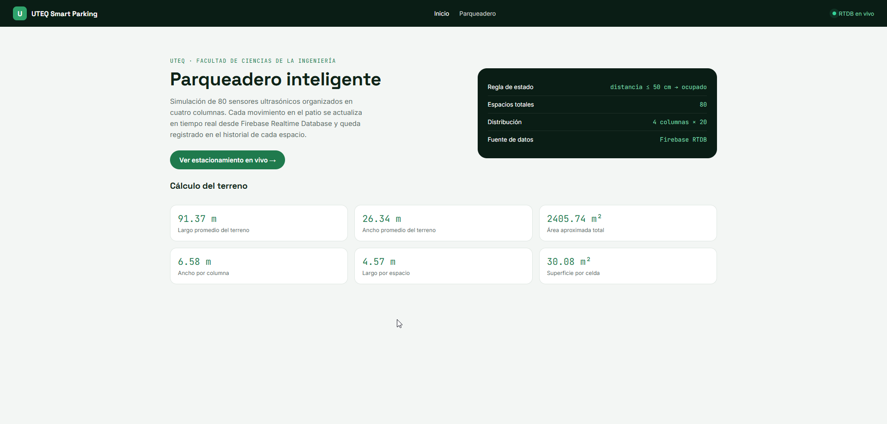
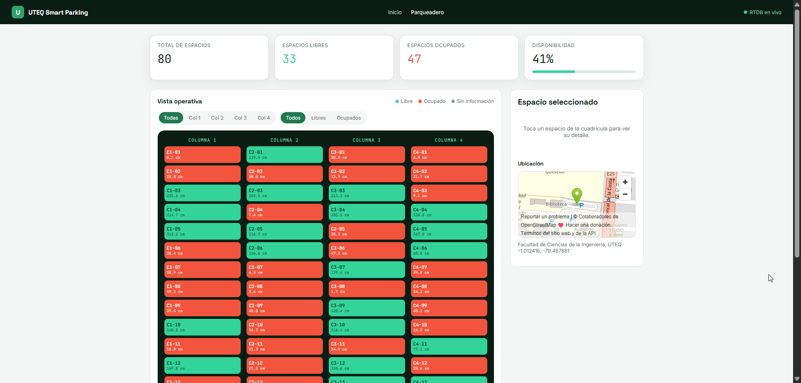

# 🅿️ Parqueadero Inteligente UTEQ

Aplicación web inteligente para la gestión de estacionamientos desarrollada con **React + Vite**, que simula un sistema de 80 espacios (4 columnas × 20) ubicado en la Universidad Técnica Estatal de Quevedo. Cada espacio está asociado a un sensor simulado que escribe en tiempo real a **Firebase Realtime Database**.

## 📸 Galería de Vistas

<div align="center">
  <table>
    <tr>
      <td align="center">
        
        <br><strong>Interfaz de Parqueadero</strong>
      </td>
      <td align="center">
        
        <br><strong>Visualización de Espacios</strong>
      </td>
    </tr>
  </table>
</div>

## ✨ Características Principales

- 🎯 **80 Espacios Inteligentes**: Sistema de 4 columnas × 20 filas con sensores simulados
- 🔄 **Sincronización en Tiempo Real**: Integración directa con Firebase Realtime Database
- 📊 **Estadísticas Dinámicas**: Resumen instantáneo de espacios libres/ocupados
- 🗺️ **Mapa Interactivo**: Visualización geoespacial de los estacionamientos
- 📱 **Historial Detallado**: Registro completo de cambios por espacio
- 🎨 **UI Responsiva**: Interfaz adaptable a cualquier dispositivo

## 📋 Requisitos

- Node.js 18 o superior
- Una cuenta y proyecto de Firebase con **Realtime Database** habilitada

## 🚀 Quick Start

### 1️⃣ Instalación

```bash
git clone <URL_DE_TU_REPOSITORIO>
cd parqueadero-uteq
npm install
```

### 2️⃣ Configurar Firebase

1. Ve a [Firebase Console](https://console.firebase.google.com/) → tu proyecto
   → ⚙️ **Configuración del proyecto** → pestaña **Tus apps** → app web (o
   crea una con el ícono `</>`).
2. Copia el objeto `firebaseConfig` que te entrega Firebase.
3. Pégalo en [src/services/firebase.js](src/services/firebase.js), reemplazando los valores de
   ejemplo (`TU_API_KEY`, `TU_PROYECTO`, etc.).
4. En la sección **Realtime Database → Reglas**, para desarrollo puedes usar
   temporalmente:

   ```json
   {
     "rules": {
       ".read": true,
       ".write": true
     }
   }
   ```

   ⚠️ **Para producción**, restringe las reglas (por ejemplo, exigiendo
   autenticación) antes de publicar el proyecto.

### 3️⃣ Ejecutar en desarrollo

```bash
npm run dev
```

Abre la URL que indica la terminal (por defecto `http://localhost:5173`).

### 4️⃣ Cargar los 80 espacios iniciales

Como tu Realtime Database está vacía, entra a la pestaña **Parqueadero**: la
app detecta que no hay datos y muestra un botón **"Sembrar 80 espacios en
Firebase"**. Al presionarlo:

- ✅ Se generan los 80 sensores (columna 1-4, número 1-20) con coordenadas
  reales calculadas por interpolación dentro del polígono del terreno
  ([src/services/geometria.js](src/services/geometria.js)).
- ✅ Se guardan en el nodo `espacios` de la RTDB.
- ✅ Se crea la primera entrada de `historial` para cada uno.

Desde ese momento, una simulación periódica (cada 8 segundos, ver
[src/services/simulador.js](src/services/simulador.js)) cambia la distancia/estado de varios sensores
al azar y registra cada cambio en el historial, tal como lo haría un sensor
ultrasónico real.

## 📁 Estructura del proyecto

```
src/
├── components/
│   ├── ResumenEstacionamiento.jsx
│   ├── CuadriculaEstacionamiento.jsx
│   ├── EspacioCard.jsx
│   ├── FiltrosEspacios.jsx
│   ├── HistorialEspacio.jsx
│   └── MapaEstacionamiento.jsx
├── hooks/
│   ├── useEspacios.jsx
│   └── useHistorialEspacio.jsx
├── pages/
│   ├── Inicio.jsx
│   ├── Estacionamiento.jsx
│   └── DetalleEspacio.jsx
├── services/
│   ├── firebase.js       # inicialización y helpers de RTDB
│   ├── geometria.js      # cálculo de coordenadas de cada celda
│   └── simulador.js      # generación y simulación de sensores
├── App.jsx
└── main.jsx
```

## 🛣️ Rutas de la Aplicación

| Ruta                | Página                                         | Descripción |
|----------------------|------------------------------------------------|-------------|
| `/`                  | Inicio                                        | Descripción del proyecto y bienvenida |
| `/estacionamiento`   | Dashboard de Parqueadero                      | Cuadrícula de 80 espacios + estadísticas |
| `/espacios/:id`      | Detalle e Historial                          | Información completa y registro de cambios de un espacio |

## ⚙️ Lógica del Sistema

### Regla de Estado del Sensor

```js
const estado = distanciaDetectada <= 50 ? 'ocupado' : 'libre';
```

- **Ocupado**: Distancia ≤ 50 cm (presencia de vehículo detectada)
- **Libre**: Distancia > 50 cm (espacio disponible)

## 🏗️ Build de Producción

```bash
npm run build
npm run preview
```

## 🌐 Despliegue (Opciones)

El build generado en `dist/` puede publicarse en:

- **Firebase Hosting** - Recomendado (integración nativa)
- **Vercel** - Deploy automático desde Git
- **Netlify** - Alternativa con configuración simple

Todas las opciones son **sin necesidad de configuración adicional**.

## 📚 Stack Tecnológico

| Tecnología | Uso |
|-----------|-----|
| **React 18** | Framework de UI |
| **Vite** | Build tool de próxima generación |
| **Firebase Realtime DB** | Base de datos en tiempo real |
| **JavaScript/JSX** | Lenguaje de programación |

## 📝 Notas Importantes

- La simulación ejecuta cambios cada **8 segundos** de forma aleatoria
- Los datos persisten en **Firebase**, no se pierden al refrescar
- El sistema está optimizado para **desarrollo local** y **producción**
- Todos los espacios tienen coordenadas geométricas reales

## 📧 Soporte y Contribuciones

Para reportar errores o sugerir mejoras, abre un *issue* en el repositorio.

---

**Desarrollado para la Universidad Técnica Estatal de Quevedo (UTEQ)** 🎓
